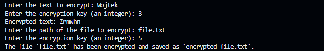

# Ceaser-cipher

def caesar_cipher(text, key):

Function is taking care about changing our word to write it in ceaser form. 
User can easly define which key is preferable to use. 

So we can also define function which will be taking txt file and changing inside text into encripted from in ceaser code.

def encrypt_file(file_path, key):

